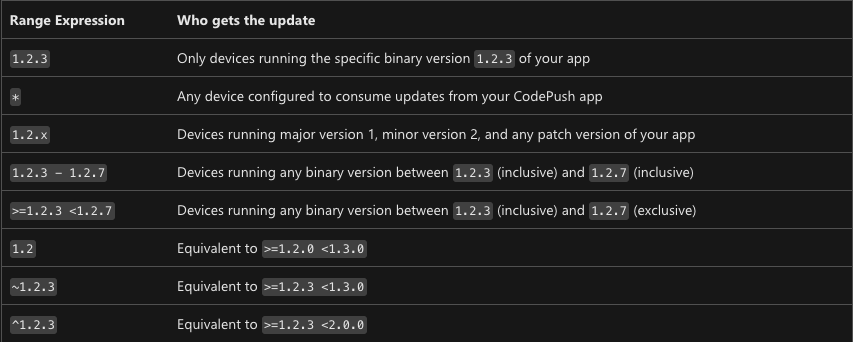

# Releasing OTA Updates with CodePush

This does not apply to local or development builds. You only need to do this if you
want to deploy new OTA updates to either the staging or production builds. Development
builds will always use the Metro server for the app bundle and will not attempt to
download a bundle from AppCenter.

## Setting up your environment

*Note: If you are not already a part of the BlueskySocial CodePush organization, you will
need to be added.*

First you need to sign in to AppCenter using the AppCenter CLI.

```sh
yarn codepush:login
```

You will be prompted to enter a code from a URL. If you have not already, authenticate with 
AppCenter in your browser and you will be given the code.

You will also need to add the CodePush deployment key to your `.env`. Note that this is not
a private key, but in an effort to support staging environments, it's easier to have this
changeable on the fly.

```
CODEPUSH_DEPLOYMENT_KEY=ProductionKeyOrStagingKey
```

Once you have saved the CodePush token to the .env, run `yarn prebuild`.

## Releasing an Update

```sh
# For staging
yarn codepush:release Staging
# For production
yarn codepush:release Production
```

Wait for CodePush to create the new React Native bundle and upload it to AppCenter. As soon
as it has finished processing, it will be available for download in the app.

When using this delivery method, the app will launch with the previous RN bundle. Once
booted, it will attempt to download the new bundle from AppCenter. The next time the app
launches (or after iOS/Android removes the app from memory), the new bundle will be 
installed during boot and used for that session onward.

**Note: Attempting to make a release whenever there are no code changes will fail, and
the CLI will tell you that no changes were detected.**

## Releasing an Emergency Update

If you need to release an emergency hotfix, you can run the same command from above, but with
the `--mandatory` flag. This should be used sparingly as it will cause the app to "reload" 
itself.

```sh
yarn codepush:release Production --mandatory
```

When using this delivery method, the app will launch with the previous RN bundle. Once
booted, it will attempt to download the new bundle from AppCenter. As soon as the download
has completed, the app will reboot, installing the new bundle. Again, this should be used
sparingly. For most hotfixes, it should be sufficient to simply release a non-mandatory
update.

## Dealing with Updated App Binaries (Native Changes)

When a new binary release is planned (i.e. moving from 1.70 to 1.71) we should take care
to ensure we specify the correct binary target.

From the CodePush docs:

> 1. If a user is running an older binary version, it's possible that there are breaking 
> changes in the CodePush update that wouldn't be compatible with what they're running.
> 2. If a user is running a newer binary version, then it's presumed that what they're 
> running is newer (and potentially incompatible) with the CodePush update

These are the available target configurations:



By default, CodePush will use the first option whenever we create a deployment. For
example, if our `package.json` lists our version as `1.70`, CodePush will use `1.70.0`
for the binary target version. For safety, we should always avoid manually supplying a
target.

For that reason, we should do the following:

1. Never manually supply a target.
2. Create CodePush deployments ahead of App Store/Google Play releases for the new
binary version.
3. Always increment the minor version (the `X` in `1.X`) when releasing a new binary
version with new native code. Never increment only the patch version (the `X` in `1.60.X`)
when new native code is added to the binary.

**Remember!** Any time you have to run `pod install` after adding an NPM package, you have
added new native code to the app! *Removing* native code between updates, however, is fine
and does not require a new app binary.

## Rolling Back

If an update is delivered that later needs to be rolled back while a fix is worked on,
you may rollback that release. This will create a new deployment that ***includes the
exact same code and metadata as the version prior to the latest one***.

```sh
# Rolls back the current Production deployment to the previous Production deployment
yarn codepush:rollback Production
# Rolls back the current Staging deployment to the previous Staging deployment
yarn codepush:rollback Staging
```

It is also possible to rollback to a particular deployment, say if you want to go backwards
by two deployments.

```sh
# If the current Production deployment is 1.68.5 and we want to rollback to 1.68.3.
# Running this without --target-release would only roll us back to 1.68.4.
yarn codepush:rollback Production --target-release v1.68.3
```

## Other Parameters

### Rollout

If there is a new feature that should be tested by a smaller group of users, the 
`--rollout X` parameter may be used, where `X` is the percentage of users who should
receive the update.

```sh
yarn codepush:release Production --rollout 20
```

### Promoting

If you wish to promote the current Staging update to Production, you do not need to
re-upload the bundle. Instead, you may `promote` the current Staging update.

```sh
# Normal release
yarn codepush:promote

# Mark this update as mandatory
yarn codepush:promote --mandatory
# Or roll out
yarn codepush:promote --rollout 20
```

### List Releases

To see a list of releases, you may run the following command.

```sh
yarn codepush:list-releases Production
yarn codepush:list-releases Staging
```

